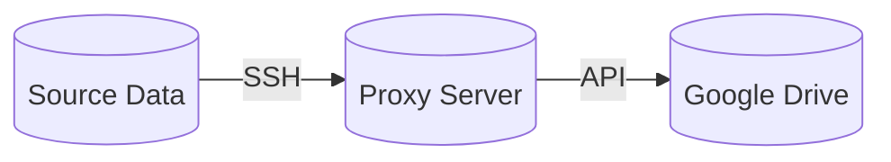

# Proxy Backup for Google Drive API

Shell scripts for secure delivery of backups from your servers to Google Drive using API:

- Creates a user for each project:
  - without password
  - with minimal rights
  - auto generating personal ssh-keys
  - send ssh-keys to admin by telegram
- Waits to receive data from the source server via SSH
- When the data appears in the project's home directory, it moves it to Google Drive



- Easy to manage projects:
  - If there are multiple projects, the credentials are stored in one secure location
- Platform-independent data source:
  - The data source platform does not matter. Simply copy the required data to the server via SSH keys

## Prerequisites

- Linux
- curl

## Installation

Clone the project as a user with `sudo`

```
git clone git@github.com:kio-by/proxy-backup.git
```

## How it works

Every minute the scripts will check the folder and if it is not empty - move its contents to Google:

### Google Drive file structure

```
parent-folder_ID_on_google
├── project-01
│   ├── 2022
│   │   ├── 2022-01-02.zip
│   │   └── 2022-03-02.zip
│   └── 2025
│       ├── 2025-01-02.zip
│       ├── 2025-03-07.zip
│       └── 2025-11-02.zip
├── project-02
│   └── 2024
│       └── 2024-01-02.zip
└── project-xx
    └── year-xx
        ├── backup-01
        └── backup-02
```

## How to use

1. Generate Google OAuth Credentials
2. `not required`: Create Telegram bot and get `CHAT_ID` and `BOT_TOKEN`
3. Edit `.env` file

```
vi /root/backup/scripts/.env
```

2. Create backup-project:

```
sudo ./sudo/00-adduser.sh
```

3. Uncomment cron task current backup-project:

```
sudo crontab -e
```

5. Copy ssh-keys to source data server
6. Move data to `/home/your_project_name/backup`. Use scripts, cron, scheduler, etc. For example:

```
scp ./backup-file.tar your_project_name@IP_backup_proxy_server:~/backup/
```

7. Generate and move temp-flag «delete.» `/home/your_project_name/backup/.temp-flag/`. It is needed to tell the script that the backup files is fully loaded. For example:

```
touch delete.my_project_name
scp ./delete.my_project_name your_project_name@IP_backup_proxy_server:~/backup/.temp-flag/
```

For new project repeat 2-7

### How to delete a project

1. Run `88-deluser.sh` and enter name of your project

```
sudo ./sudo/88-deluser.sh
```

2. Remove that note in cron tasks

### GoogleDrive Setup

Google Drive is a free service for file storage files. In order to use this storage you need a Google (or Google Apps) user which will own the files, and a Google API client.

1. Go to the [Google Developers console](https://console.developers.google.com/project) and create a new project.
   - Now you should be on the [Project Dashboard](https://console.cloud.google.com/home/dashboard)
2. Go to **APIs & Services** > **APIs** and enable **Drive API** and **Sheets API**.

#### Using Web client OAuth 2.0

1. Click **Credentials**

2. Create **OAuth Client ID** Credentials

3. Select **Web Application** as product type

4. Configure the **Authorized Redirect URI** to [https://developers.google.com/oauthplayground](https://developers.google.com/oauthplayground) *must not have a ending “/” in the URI*

5. Save your **Client ID** and **Secret** or full OAuth string

6. Now you will have a `Client ID`, `Client Secret`, and `Redirect URL`.

7. You can convert oauth string to oauth `PSObject` for future use

   ```powershell
   $oauth_json = '{"web":{"client_id":"10649365436h34234f34hhqd423478fsdfdo.apps.googleusercontent.com",
     "client_secret":"h78H78h7*H78h87",
     "redirect_uris":["https://developers.google.com/oauthplayground"]}}' | ConvertFrom-Json
   ```

8. Request Authroization Code
   - Manually
     1. Browse to [https://developers.google.com/oauthplayground](https://developers.google.com/oauthplayground)
     2. Click the gear in the right-hand corner and select “_Use your own OAuth credentials_"
     3. Fill in OAuth Client ID and OAuth Client secret
     4. Authorize the API scopes
        - [https://www.googleapis.com/auth/drive](https://www.googleapis.com/auth/drive)
        - [https://www.googleapis.com/auth/drive.file](https://www.googleapis.com/auth/drive.file)
        - [https://www.googleapis.com/auth/spreadsheets](https://www.googleapis.com/auth/spreadsheets)
     5. Save `Authorization Code` or directly **Exchange authorization code** for tokens
     6. Save `Refresh token`, it can not be requested again without new Authorization code

## Script file system

```
/
├── root
│   ├── backup
│   │   └── project-name
│   │       ├── .env.local
│   │       ├── ln -> .env
│   │       ├── ln -> run-backup.sh
│   │       └── ln -> google-api.sh
│   └── scripts
│       ├── .env
│       ├── ln -> run-backup.sh
│       ├── ln -> google-api.sh
│       ├── ln -> telegram-message.sh
│       └── ln -> telegram-message.sh
└── home
    ├── sudo_user
    │   └── proxy-backup
    │       ├── sudo
    │       │   ├── 00-adduser.sh
    │       │   └── 88-deluser.sh
    │       └── root
    │           ├── google-api.sh
    │           ├── run-backup.sh
    │           ├── telegram-message.sh
    │           └── telegram-message.sh
    └── project-name
        └── backup
            ├── backup.file1
            ├── backup.file2
            └── .temp-flag
                └── delete.file
```
